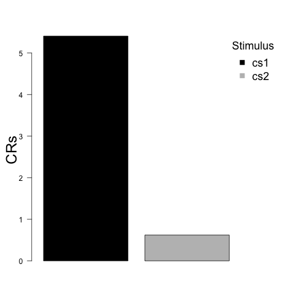

# condir

R package for the analysis of conditioning data.

## Warning: This is work in progress so many analyses are not complete.

### Installation

```r
install.packages ("devtools") # If not already installed
```

```
## also installing the dependency 'withr'
```

```
## package 'withr' successfully unpacked and MD5 sums checked
## package 'devtools' successfully unpacked and MD5 sums checked
## 
## The downloaded binary packages are in
## 	C:\Users\Krypo001\AppData\Local\Temp\Rtmp4CQamP\downloaded_packages
```

```r
library(devtools)
install_github(repo = "AngelosPsy/condir")
```

```
## Downloading GitHub repo AngelosPsy/condir@master
## from URL https://api.github.com/repos/AngelosPsy/condir/zipball/master
```

```
## Installing condir
```

```
## "C:/PROGRA~1/R/R-32~1.3/bin/x64/R" --no-site-file --no-environ --no-save  \
##   --no-restore CMD INSTALL  \
##   "C:/Users/Krypo001/AppData/Local/Temp/Rtmp4CQamP/devtools1448ee3911/AngelosPsy-condir-57e6f19"  \
##   --library="C:/Program Files/R/R-3.2.3/library" --install-tests
```

```
## 
```

```r
library(condir)
```

### Load package

```r
library(condir)
```

### One group example

```r
cs1 = rnorm(50, 5, 5)
cs2 = rnorm(50, 1, 5)
tmp <- csCompare(cs1, cs2)
tmp
```

```
## $freq.results
##          method alternative       WG1      WpG1 WG2 WpG2 null.value
## 1 Paired t-test   two.sided 0.9826189 0.6663795   0    0          0
##        LCI      HCI t.statistic df      p.value
## 1 3.743934 7.691389    5.821508 49 4.403303e-07
## 
## $bayes.results
##    LNI HNI rscale     bf10         bf01    propError
## 1 -Inf Inf  0.707 35334.47 2.830097e-05 2.204976e-09
## 
## $descriptives
##     vars  n  mean   sd  se
## cs1    1 50  5.39 4.97 0.7
## cs2    2 50 -0.33 4.28 0.6
```

```r
csPlot(cs1, cs2, ylab = "CRs")
```


```r
csReport(tmp)
```

```
## We perfromed a two.sided Paired t-test. The results of the t-test are t (49) = 5.822, p = 0. We perfromed a two.sidedBayesian t-test, with a Catchy prior, with its width set to 0.707. The BF10 was equal to BF10 = 35334.47. The BF01 was equal to BF01 = 0.
```

```r
tmp <- csSensitivity(cs1, cs2)
csRobustnessPlot(cs1, cs2, BF01 = FALSE)
```



```r
csReport(csSensitivityObj = tmp)
```

```
## We perfromed a Sensitivity Analysis using the scaling factors: medium, wide, ultrawide. The results for BF01 were: 0, 0, 0 respectively. The results for BF10 were: 35334.93, 34473.14, 30316.46 respectively.
```

### Two groups example

```r
group = rep(1:2, 50)
tmp <- csCompare(cs1, cs2, group)
```

```
## Error in tapply(seq_len(50L), structure(list(group = c(1L, 2L, 1L, 2L, : arguments must have same length
```

```r
tmp
```

```
##   nG1 nG2  LNI HNI    rscale             bf10                 bf01
## 1  50   0 -Inf Inf    medium 35334.9342280307 2.83006045390262e-05
## 2  50   0 -Inf Inf      wide 34473.1368647305 2.90080941552812e-05
## 3  50   0 -Inf Inf ultrawide 30316.4633660206 3.29853778762606e-05
##              propError
## 1 2.20662620707926e-09
## 2  7.1477571715222e-14
## 3 3.15246984132043e-14
```

```r
csPlot(cs1, cs2, group = group)
```

```
## Error in tapply(seq_len(50L), structure(list(group = c(1L, 2L, 1L, 2L, : arguments must have same length
```

```r
csReport(csCompareObj = tmp)
```

```
## We perfromed a  . The results of the t-test are t () = , p = . We perfromed a Bayesian t-test, with a Catchy prior, with its width set to . The BF10 was equal to BF10 = . The BF01 was equal to BF01 = .
```

```r
tmp <- csSensitivity(cs1, cs2)
csRobustnessPlot(cs1, cs2, group, BF01 = FALSE)
```

```
## Error in tapply(seq_len(50L), structure(list(group = c(1L, 2L, 1L, 2L, : arguments must have same length
```

```r
csReport(csSensitivityObj = tmp)
```

```
## We perfromed a Sensitivity Analysis using the scaling factors: medium, wide, ultrawide. The results for BF01 were: 0, 0, 0 respectively. The results for BF10 were: 35334.93, 34473.14, 30316.46 respectively.
```
