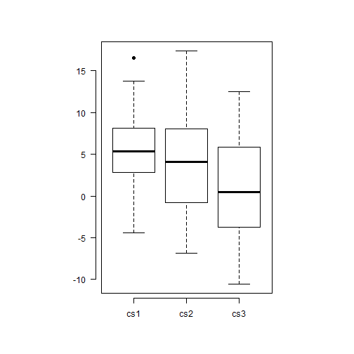
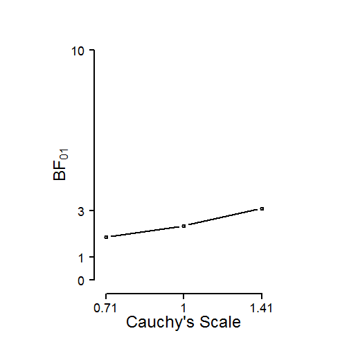

# condir

R package for the analysis of conditioning data.

Below we provide two basic examples that use the R package _condir_. The first
example regards data coming from a single group, and the second example data
coming from two groups. More details about the package condir are described in
the paper by 
Krypotos, A.-M., Klugkist, K., and Engelhard, I. M. (submitted). 
Bayesian Hypothesis Testing for Human Threat Conditioning Research: 
An introduction and the condir R package.


### Installation
To install condir, you first need to install and load the devtools package.
This is done as follows.

```r
install.packages ("devtools")
library(devtools)
```

Now, the condir package can be installed by simply typing the following command
in the R console.


```r
install_github(repo = "AngelosPsy/condir")
```

For loading condir, use the line below. Please note that for using condir, you
have to load it at every new R session.


```r
library(condir)
```

### One group example
Here we show a single group example. Specifically, we first simulate data from
a normal distribution for two stimuli, the cs1 and the cs2.


```r
set.seed(100)
cs1 <- rnorm(50, 5, 5)
cs2 <- rnorm(50, 4.5, 5)
```

These data correspond to the conditioned responses during the presentation of
each stimulus (i.e., the cs1 and the cs2). For comparing the two stimuli, we
can use the csCompare function in condir as follow.


```r
tmp <- csCompare(cs1, cs2)
```


```r
tmp
```

```
$descriptives
    vars  n mean   sd median trimmed  mad   min   max range   se
cs1    1 50 5.41 4.10   5.33    5.31 3.74 -4.39 16.55 20.94 0.58
cs2    2 50 4.12 5.96   4.09    3.98 6.34 -6.86 17.41 24.27 0.84

$freq.results
         method alternative       WG1      WpG1 WG2 WpG2 null.value
1 Paired t-test   two.sided 0.9738392 0.3292263   0    0          0
         LCI      HCI t.statistic df   p.value
1 -0.3911855 2.963113    1.540853 49 0.1297863

$bayes.results
   LNI HNI rscale      bf10     bf01    propError
1 -Inf Inf  0.707 0.4640282 2.155041 3.081811e-08
```

The data can be plotted with the csPlot function.


```r
csPlot(cs1, cs2, ylab = "CRs")
```


In order to make a basic report of the data, we use the csReport function.


```r
csReport(tmp)
```

```


We performed a two sided paired t-test. The results are t (49) = 1.541, p  =  0.13. These results suggest that there are no statistically significant differences between cs1 and cs2 for an alpha level of 0.05.

 
We performed a two sided Bayesian t-test, with a Cauchy prior, with its width set to 0.707. The BF01 was: BF01(0.707)  =  0.464. The BF10 was: BF10(0.707)  =  2.155.

The results suggest that there is no evidence for H1, relative to H0.

The results suggest that there is anecdotal evidence for H0, relative to H1.
```

Lastly, the csSensitivity function can be used for a sensitivity analysis,
with the csRobustnessPlot function plotting the results.


```r
tmp <- csSensitivity(cs1, cs2)
csRobustnessPlot(cs1, cs2, BF01 = TRUE)
```


The results are now reported with the csReport function.


```r
csReport(csSensitivityObj = tmp)
```

```
We performed a Sensitivity Analysis using the scaling factors: 0.707, 1, 1.41. The results for BF01 were: BF01(0.707)  =  2.155, BF01(1)  =  2.89, BF01(1.41)  =  3.956 respectively. The results for BF10 were: BF10(0.707)  =  0.464, BF10(1)  =  0.346, BF10(1.41)  =  0.253 respectively.
```

### Two groups example

The same steps as above are used for the two group example. The only difference
is that we now have to define the group allocation by using the group argument
-- see the first line below. Apart from that, the code is the same as in the 
example above. That is why we provide the code for this example 
in a single chunk of code.


```r
group <- rep(1:2, 25)
tmp <- csCompare(cs1, cs2, group = group)
```



```r
tmp
```

```
$descriptives
group: 1
    vars  n mean   sd median trimmed  mad    min   max range   se
cs1    1 25 3.32 2.80   3.18    3.38 2.64  -3.88 10.33 14.21 0.56
cs2    2 25 3.07 5.15   2.61    3.09 5.81  -6.86 13.14 20.00 1.03
cs3    3 25 0.24 5.58   0.47    0.33 6.21 -10.53 12.44 22.98 1.12
-------------------------------------------------------- 
group: 2
    vars  n mean   sd median trimmed  mad   min   max range   se
cs1    1 25 7.50 4.16   7.55    7.56 3.07 -4.39 16.55 20.94 0.83
cs2    2 25 5.17 6.61   4.25    5.06 7.52 -5.87 17.41 23.28 1.32
cs3    3 25 2.33 6.14   1.33    2.26 6.74 -8.71 12.51 21.22 1.23

$freq.results
                   method alternative       WG1      WpG1      WG2
1 Welch Two Sample t-test   two.sided 0.9786503 0.8571079 0.945581
       WpG2 null.value       LCI      HCI t.statistic       df   p.value
1 0.1989623          0 -5.421001 1.253531   -1.255701 47.57035 0.2153574

$bayes.results
   LNI HNI rscale      bf10     bf01    propError
1 -Inf Inf  0.707 0.5379827 1.858796 0.0002218691
```

```r
csPlot(cs1, cs2, group = group, ylab = "CRs")
```


```r
csReport(csCompareObj = tmp)
```

```


We performed a two sided Welch two sample t-test. The results are t (47.57) = -1.256, p  =  0.215. These results suggest that there are no statistically significant between group differences, for an alpha level of 0.05.

 
We performed a two sided Bayesian t-test, with a Cauchy prior, with its width set to 0.707. The BF01 was: BF01(0.707)  =  0.538. The BF10 was: BF10(0.707)  =  1.859.

The results suggest that there is no evidence for H1, relative to H0.

The results suggest that there is anecdotal evidence for H0, relative to H1.
```

```r
tmp <- csSensitivity(cs1, cs2)
csRobustnessPlot(cs1, cs2, group, BF01 = TRUE)
```



```r
csReport(csSensitivityObj = tmp)
```

```
We performed a Sensitivity Analysis using the scaling factors: 0.707, 1, 1.41. The results for BF01 were: BF01(0.707)  =  2.155, BF01(1)  =  2.89, BF01(1.41)  =  3.956 respectively. The results for BF10 were: BF10(0.707)  =  0.464, BF10(1)  =  0.346, BF10(1.41)  =  0.253 respectively.
```
