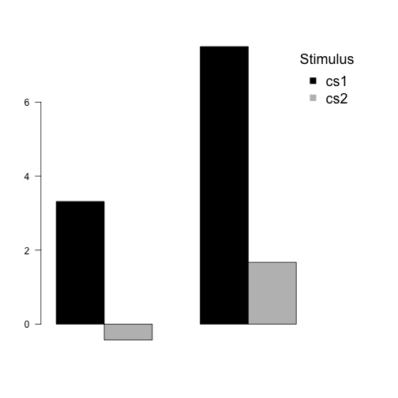

# condir

R package for the analysis of conditioning data.

## Warning: This is work in progress so many analyses are not complete.

### Installation

```r
install.packages ("devtools") # If not already installed
library(devtools)
install_github(repo = "AngelosPsy/condir")
library(condir)
```

### Load package

```r
library(condir)
```

### One group example

```r
set.seed(100)
cs1 <- rnorm(50, 5, 5)
cs2 <- rnorm(50, 1, 5)
tmp <- csCompare(cs1, cs2)
```


```r
tmp
```

```
## $descriptives
##     vars  n mean   sd median trimmed  mad    min   max range   se
## cs1    1 50 5.41 4.10   5.33    5.31 3.74  -4.39 16.55 20.94 0.58
## cs2    2 50 0.62 5.96   0.59    0.48 6.34 -10.36 13.91 24.27 0.84
## 
## $freq.results
##          method alternative       WG1      WpG1 WG2 WpG2 null.value
## 1 Paired t-test   two.sided 0.9738392 0.3292263   0    0          0
##        LCI      HCI t.statistic df      p.value
## 1 3.108814 6.463113    5.734584 49 5.984977e-07
## 
## $bayes.results
##    LNI HNI rscale    bf10         bf01    propError
## 1 -Inf Inf  0.707 26492.7 3.774625e-05 3.810462e-09
```

```r
csPlot(cs1, cs2, ylab = "CRs")
```


```r
csReport(tmp)
```

```
## [1] "\n\nWe performed a two.sided paired t-test. The results are t (49) = 5.7345844191611, p < 0.001.These results suggest that there are statistically significant between group differences, for an alpha level of 0.05.\n\n \nWe perfromed a two.sided Bayesian t-test, with a Catchy prior, with its width set to 0.707. The BF10 was BF10BF01(0.707)  >  1000. The BF01 was BF01BF01(0.707)  <  1e-04.\n\nThe results suggest that there is decisive evidence for H1, relative to H0.\n\nThe results suggest that there is no evidence for H0, relative to H1."
```

```r
tmp <- csSensitivity(cs1, cs2)
csRobustnessPlot(cs1, cs2, BF01 = FALSE)
```


```r
csReport(csSensitivityObj = tmp)
```

```
## [1] "We perfromed a Sensitivity Analysis using the scaling factors: 0.707, 1, 1.41. The results for BF01 were: BF01(0.707)  <  1e-04, BF01(1)  <  1e-04, BF01(1.41)  <  1e-04 respectively. The results for BF10 were: BF01(0.707)  >  1000, BF01(1)  >  1000, BF01(1.41)  >  1000 respectively."
```

### Two groups example

```r
group <- rep(1:2, 25)
tmp <- csCompare(cs1, cs2, group)
```


```r
tmp
```

```
## $descriptives
## group: 1
##     vars  n  mean   sd median trimmed  mad    min   max range   se
## cs1    1 25  3.32 2.80   3.18    3.38 2.64  -3.88 10.33 14.21 0.56
## cs2    2 25 -0.43 5.15  -0.89   -0.41 5.81 -10.36  9.64 20.00 1.03
## cs3    3 25  3.74 5.58   3.97    3.83 6.21  -7.03 15.94 22.98 1.12
## -------------------------------------------------------- 
## group: 2
##     vars  n mean   sd median trimmed  mad   min   max range   se
## cs1    1 25 7.50 4.16   7.55    7.56 3.07 -4.39 16.55 20.94 0.83
## cs2    2 25 1.67 6.61   0.75    1.56 7.52 -9.37 13.91 23.28 1.32
## cs3    3 25 5.83 6.14   4.83    5.76 6.74 -5.21 16.01 21.22 1.23
## 
## $freq.results
##                    method alternative       WG1      WpG1      WG2
## 1 Welch Two Sample t-test   two.sided 0.9786503 0.8571079 0.945581
##        WpG2 null.value       LCI      HCI t.statistic       df   p.value
## 1 0.1989623          0 -5.421001 1.253531   -1.255701 47.57035 0.2153574
## 
## $bayes.results
##    LNI HNI rscale      bf10     bf01    propError
## 1 -Inf Inf  0.707 0.5379827 1.858796 0.0002218691
```

```r
csPlot(cs1, cs2, group = group)
```

```
## $mean
## [1]  3.3156438 -0.4284526
## 
## $mean
## [1] 7.499446 1.671614
## 
## $se
## [1] 0.5602698 1.0304205
## 
## $se
## [1] 0.831225 1.322398
```



```r
csReport(csCompareObj = tmp)
```

```
## [1] "\n\nWe performed a two.sided welch two sample t-test. The results are t (47.57) = -1.25570062731001, p  =  0.215.These results suggest that there are no statistically significant between group differences, for an alpha level of 0.05.\n\n \nWe perfromed a two.sided Bayesian t-test, with a Catchy prior, with its width set to 0.707. The BF10 was BF10BF01(0.707)  =  0.538. The BF01 was BF01BF01(0.707)  =  1.859.\n\nThe results suggest that there is no evidence for H1, relative to H0.\n\nThe results suggest that there is anecdotal evidence for H0, relative to H1."
```

```r
tmp <- csSensitivity(cs1, cs2)
csRobustnessPlot(cs1, cs2, group, BF01 = FALSE)
```


```r
csReport(csSensitivityObj = tmp)
```

```
## [1] "We perfromed a Sensitivity Analysis using the scaling factors: 0.707, 1, 1.41. The results for BF01 were: BF01(0.707)  <  1e-04, BF01(1)  <  1e-04, BF01(1.41)  <  1e-04 respectively. The results for BF10 were: BF01(0.707)  >  1000, BF01(1)  >  1000, BF01(1.41)  >  1000 respectively."
```
